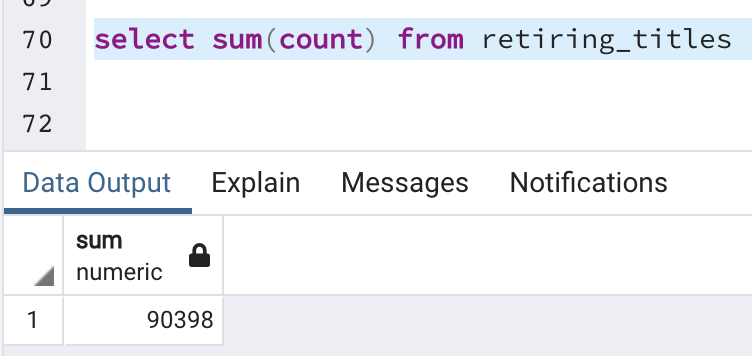
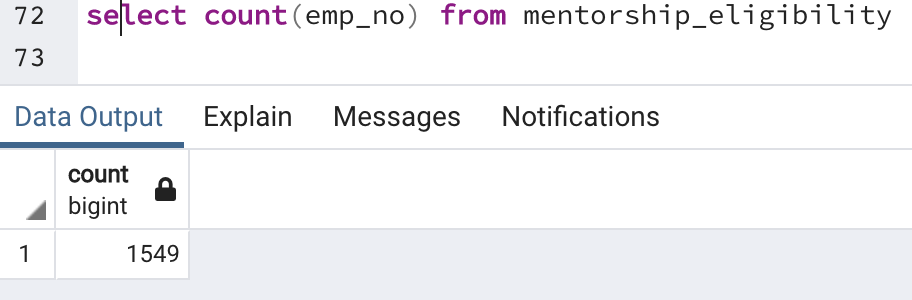
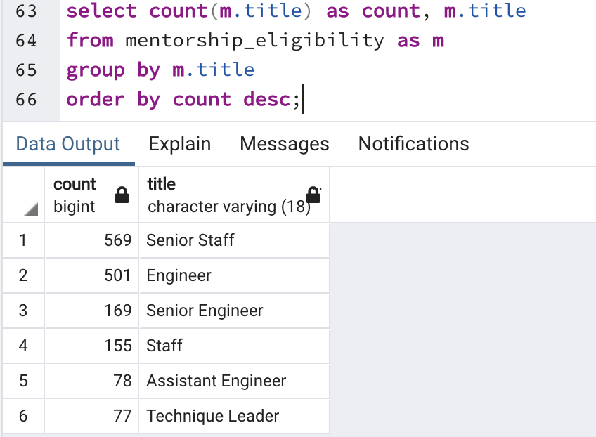
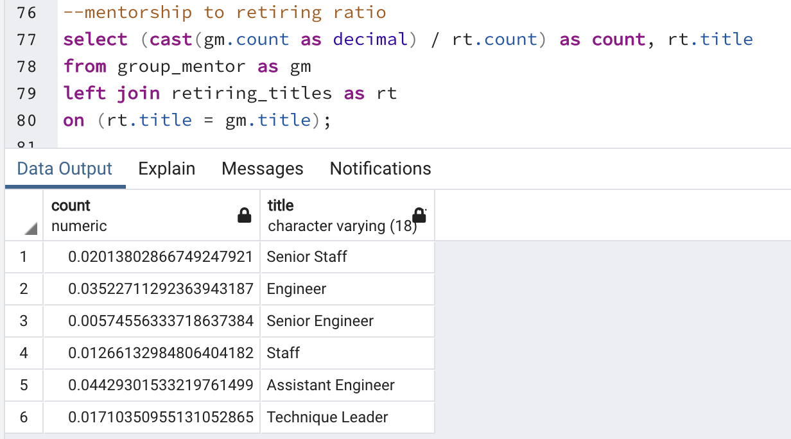

# Pewlett-Hackard-Analysis
## The Silver Tsunami

 

### Overview
* 
 The purpose of this analysis was to be able to see how many employees were retiring, and how to make sure that there would be an easily transition between a new wave of employees and The Silver Tsunami. 

### Results
* It appears that the majority of employees that will need to be replaced are Senior Engineers and Senior Staff. Which is un surprising, but also a signifcant challenge as these employees are crucial. 
* However, with so few managers and assistent engineers retiring it implies that those positions are ready to be promoted, so we might only have to replace those lower level employees.
* There is a total of 90,398 employees retiring 
* There are 1549 employees eligible for the mentorship program. 
  
### Summary
* With the "Silver Tsunami" Incoming, it appears as though there will be 90,398 employees that will need to be replaced. 

* However, there are only 1549 employees that are eligible for mentorship. So as a one for one retiring to mentor there is not enough.

* With that being said, here is a count of the employees eligibale for mentorship by title. Below that is the ratio of eligibale mentors titles over the retiring titles to best inform the structor of the mentorship program.

